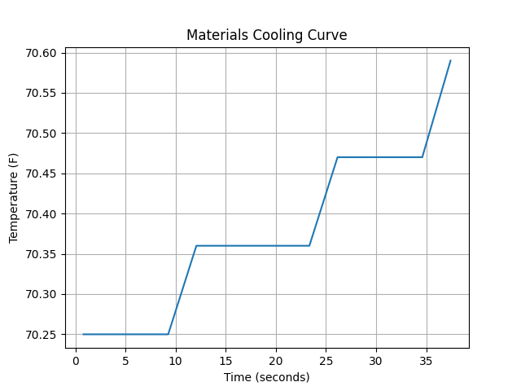
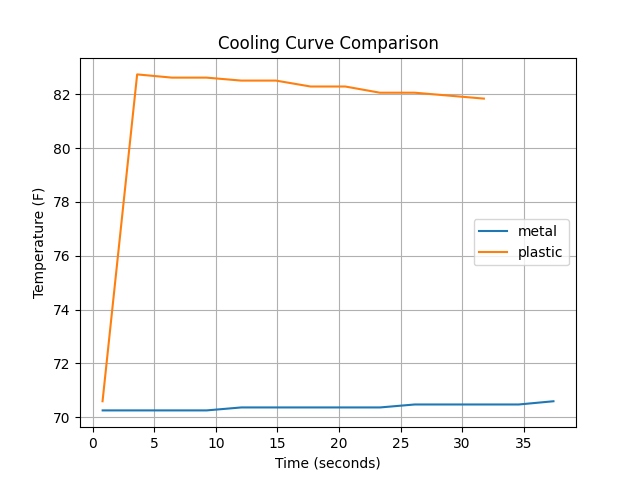

# Temperature/Heat Analysis of Materials Project

## Overview

This project uses a Raspberry Pi and Python to investigate how different materials respond to temperature changes when exposed to the same heat source. Temperature data is collected using a sensor, analyzed using Python scripts, and visualized through graphs to compare material performance.

The project combines concepts from Materials Science, Physics, Data Analysis, and Programming.

---

## Research Question

How do different materials respond to the same heating conditions, and which material heats up the fastest?

---

## Objectives

* Collect temperature data from different materials.
* Measure heating rates.
* Compare thermal behavior between materials.
* Visualize experimental results.
* Rank materials based on thermal response.

---

## Hardware

* Raspberry Pi 4
* Temperature Sensor
* Heat Source
* Material Samples

---

## Software

* Python 3
* CSV Data Storage
* Matplotlib
* NumPy
* Raspberry Pi OS

---

# Project Structure

```text
Materials_project1/
├── README.md
├── .gitignore
│
├── experimental_data/
│   ├── air_data.csv
│   ├── eraser_data.csv
│   ├── metal_data.csv
│   ├── mouth_data.csv
│   ├── plastic_data.csv
│   ├── skin_data.csv
│   └── temp_data.csv
│
├── sample_graphs/
│   ├── graph.png
│   └── comparison.png
│
└── src/
    ├── test_temp.py
    ├── graph.py
    ├── heating_rate.py
    ├── compare.py
    ├── error_analysis.py
    ├── rank_materials.py
    └── trial_statistics.py
```

---
# Data Flow

```text
Temperature Sensor
        ↓
test_temp.py
        ↓
experimental_data/*.csv
        ↓
graph.py
        ↓
sample_graphs/*.png
        ↓
compare.py / heating_rate.py / rank_materials.py
```

# Script Descriptions

## test_temp.py

Collects temperature readings from the Raspberry Pi sensor and stores them in CSV files for analysis.

### Functions

* Reads temperature data from the sensor.
* Records temperatures over time.
* Saves experimental data to CSV files.
* Creates datasets for later analysis.

---

## graph.py

Generates graphs from experimental data.

### Functions

* Reads CSV data files.
* Produces temperature vs. time graphs.
* Saves graphs for later comparison.

---

## heating_rate.py

Calculates how quickly a material heats up.

### Functions

* Computes change in temperature over time.
* Determines heating rates.
* Compares thermal response between materials.

---

## compare.py

Compares multiple materials on a single graph.

### Functions

* Loads multiple datasets.
* Generates comparison plots.
* Highlights differences in heating behavior.

---

## error_analysis.py

Evaluates uncertainty and experimental variation.

### Functions

* Compares repeated measurements.
* Calculates variation between trials.
* Identifies possible sources of error.

---

## trial_statistics.py

Calculates summary statistics for experimental trials.

### Functions

* Calculates averages.
* Finds maximum temperatures.
* Summarizes experimental performance.

---

## rank_materials.py

Ranks materials based on experimental performance.

### Functions

* Uses heating rates and statistical data.
* Produces a final ranking.
* Identifies the best-performing materials.

---

# Materials Tested

* Metal
* Plastic
* Eraser
* Air
* Skin
* Mouth

---

# Experimental Procedure

### Step 1: Select Material

Choose the material to be tested and place the temperature sensor consistently.

### Step 2: Collect Data

Run:

```bash
python src/test_temp.py
```

The script records temperature measurements and stores the results.

### Step 3: Apply Heat

Expose the material to the same heat source while maintaining consistent experimental conditions.

### Step 4: Store Results

Experimental data is saved inside:

```text
experimental_data/
```

### Step 5: Generate Graphs

Run:

```bash
python src/graph.py
```

Generated graphs are stored inside:

```text
sample_graphs/
```

### Step 6: Calculate Heating Rates

Run:

```bash
python src/heating_rate.py
```

### Step 7: Compare Materials

Run:

```bash
python src/compare.py
```

### Step 8: Analyze Error

Run:

```bash
python src/error_analysis.py
```

### Step 9: Calculate Statistics

Run:

```bash
python src/trial_statistics.py
```

### Step 10: Rank Materials

Run:

```bash
python src/rank_materials.py
```

The final ranking is generated based on experimental results.

---

# Sample Results

The following graphs were generated using temperature data collected during experimentation and stored in the `experimental_data/` directory.

## Temperature vs. Time

This graph shows how temperature changes over time during a heating trial.



*Figure 1. Temperature versus time for a material exposed to a constant heat source.*

---

## Material Comparison

This graph compares the thermal response of multiple materials under identical heating conditions.



*Figure 2. Comparison of temperature response across tested materials.*

---

## Experimental Data

The raw experimental data used to generate these graphs can be found in the `experimental_data/` folder.

Example datasets:

- `experimental_data/metal_data.csv`
- `experimental_data/plastic_data.csv`
- `experimental_data/air_data.csv`
- `experimental_data/eraser_data.csv`
- `experimental_data/skin_data.csv`
- `experimental_data/mouth_data.csv`

These datasets contain the time-series temperature measurements collected by the Raspberry Pi temperature sensor during testing.

---

# Future Improvements

* Add cooling-rate analysis.
* Test additional engineering materials.
* Add real-time dashboard support.
* Automate report generation.
* Investigate thermal conductivity relationships.

---

# Author

Abhiram

Independent Raspberry Pi and Materials Science research project focused on thermal behavior and heat transfer analysis.
